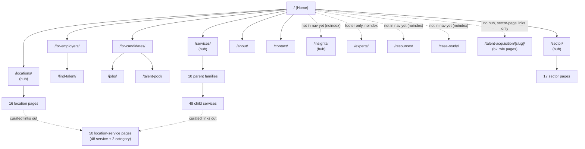
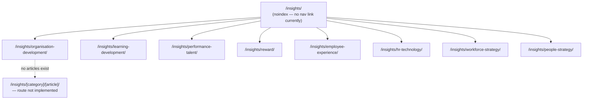
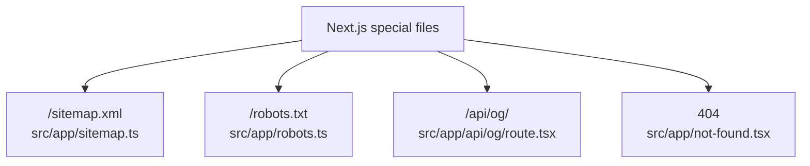

# Apex HR — Local Website Architecture

**Purpose:** show the team lead how the local Next.js codebase is actually structured, right now.
**Scope:** the local repository only. No page on `www.apexhrllc.co.uk` was visited, crawled, or used as a source. No old-site sitemap, no Google-indexed page, no production response was consulted. Every route, count and relationship below was read directly from local files (`src/app/`, `src/config/`, `src/content/`) or derived with small local scripts run against those same files.
**No code was changed.** `src/app/sitemap.ts` was not modified. No route, page, content, metadata or component was altered. This is a read-only audit.
**URL format:** every URL in this document is a relative local path (e.g. `/services/`), never prefixed with a domain.

---

## 0. Summary

| Metric | Count |
| --- | ---: |
| Total local routes (file-based route definitions under `src/app/`) | 20 page routes + `sitemap.ts` + `robots.ts` + 1 API route + `not-found.tsx` |
| Total public pages (every concrete URL the site renders for visitors) | **226** |
| Total parent-service pages | **10** |
| Total child-service pages | **48** |
| Total sector pages | **17** |
| Total main location pages | **16** |
| Total location-service pages (service + category combinations) | **50** (48 service-location + 2 category-location) |
| Total employer pages | **3** (`/for-employers/`, `/find-talent/`, `/contact/`) |
| Total candidate pages | **3** (`/for-candidates/`, `/jobs/`, `/talent-pool/`) |
| Total insight pages | **9** (1 hub + 8 categories; 0 articles) |
| Total legal pages | **0** |
| Total admin and API routes | **1** (`/api/og/`, an image endpoint — no admin/login/preview/test route exists) |
| Total redirects | **116** (`src/config/redirects.ts`) |
| Total noindex or provisional public pages | **15** |
| Total talent-acquisition role pages | **62** (not listed above as a named category in the brief, included for completeness) |

Everything below explains how these numbers were derived and cross-checked.

---

## 1. Mermaid diagrams

### 1.1 Main website architecture



### 1.2 Services and child services

```mermaid
flowchart TD
    ServicesHub["/services/"]
    ServicesHub --> OHR["/services/outsourced-hr-services-firm-in-the-uk/\n(6 children)"]
    ServicesHub --> RTA["/services/recruitment-and-talent-acquisition-firm-in-the-uk/\n(5 children)"]
    ServicesHub --> ELR["/services/employment-law-and-employee-relations-firm-in-the-uk/\n(8 children)"]
    ServicesHub --> ODC["/services/organisation-development-and-change-management-firm-in-the-uk/\n(4 children)"]
    ServicesHub --> CRB["/services/compensation-reward-and-benefits-firm-in-the-uk/\n(6 children)"]
    ServicesHub --> LLD["/services/learning-and-leadership-development-firm-in-the-uk/\n(3 children)"]
    ServicesHub --> PTM["/services/performance-and-talent-management-firm-in-the-uk/\n(3 children)"]
    ServicesHub --> EEE["/services/employee-experience-and-engagement-firm-in-the-uk/\n(5 children)"]
    ServicesHub --> HRT["/services/hr-technology-and-people-analytics-firm-in-the-uk/\n(5 children)"]
    ServicesHub --> SHR["/services/strategic-hr-and-workforce-advisory-firm-in-the-uk/\n(3 children)"]

    OHR --> OHR1["retained-hr-services-firm-in-the-uk"]
    OHR --> OHR2["hr-support-for-small-businesses-and-startups-firm-in-the-uk"]
    OHR --> OHR3["fractional-hr-director-chief-people-officer-firm-in-the-uk"]
    OHR --> OHR4["hr-compliance-audit-firm-in-the-uk"]
    OHR --> OHR5["employee-handbooks-and-hr-policies-firm-in-the-uk"]
    OHR --> OHR6["payroll-advisory-firm-in-the-uk"]

    RTA --> RTA1["permanent-recruitment-firm-in-the-uk"]
    RTA --> RTA2["executive-search-firm-in-the-uk"]
    RTA --> RTA3["contract-staffing-firm-in-the-uk"]
    RTA --> RTA4["recruitment-process-outsourcing-rpo-firm-in-the-uk"]
    RTA --> RTA5["graduate-schemes-and-early-careers-design-firm-in-the-uk"]
```



*Route template for every card above: `/services/[slug]-firm-in-the-uk/` (D-017). The remaining 8 families' 37 children (Employment Law 8, Org Development 4, Compensation 6, Learning 3, Performance 3, Employee Experience 5, HR Technology 5, Strategic HR 3) are omitted from this diagram to keep it readable — the full list is in §3.2's table.*

### 1.3 Sectors

```mermaid
flowchart TD
    SectorsHub["/sector/ (17 sectors)"]
    SectorsHub --> S1["hr-company-for-startups-and-scale-ups-in-the-uk"]
    SectorsHub --> S2["hr-company-for-professional-services-in-the-uk"]
    SectorsHub --> S3["hr-company-for-healthcare-in-the-uk"]
    SectorsHub --> S4["hr-company-for-life-sciences-in-the-uk"]
    SectorsHub --> S5["hr-company-for-it-in-the-uk (IT)"]
    SectorsHub --> S6["hr-company-for-financial-services-in-the-uk"]
    SectorsHub --> S7["hr-company-for-accountants-in-the-uk"]
    SectorsHub --> S8["hr-company-for-architects-in-the-uk"]
    SectorsHub --> S9["hr-company-for-care-homes-in-the-uk"]
    SectorsHub --> S10["hr-company-for-charity-in-the-uk"]
    SectorsHub --> S11["hr-company-for-construction-in-the-uk"]
    SectorsHub --> S12["hr-company-for-distribution-in-the-uk"]
    SectorsHub --> S13["hr-company-for-education-in-the-uk"]
    SectorsHub --> S14["hr-company-for-engineers-in-the-uk"]
    SectorsHub --> S15["hr-company-for-leisure-in-the-uk"]
    SectorsHub --> S16["hr-company-for-manufacturers-in-the-uk"]
    SectorsHub --> S17["hr-company-for-hospitality-in-the-uk"]
```



*Route template: `/sector/hr-company-for-[slug]-in-the-uk/` (D-017). Note `hr-company-for-it-in-the-uk` is IT's slug — see §4 for the "shared URL" question this raises and why it's not actually a conflict.*

### 1.4 Locations and location-service pages

```mermaid
flowchart TD
    LocationsHub["/locations/ (16 locations)"]
    LocationsHub --> London["/locations/london/"]
    LocationsHub --> Manchester["/locations/manchester/"]
    LocationsHub --> Other["...13 more location pages"]

    London --> LSvc1["/services/executive-search-firm-in-the-uk-london/"]
    London --> LSvc2["/services/salary-benchmarking-firm-in-the-uk-london/"]
    London --> LSvc3["/services/employer-branding-and-employee-value-proposition-evp-firm-in-the-uk-london/"]

    Worcester["/locations/worcester/"] --> WSvc1["/services/permanent-recruitment-firm-in-the-uk-worcester/"]
    Worcester --> WSvc2["/services/hr-support-for-small-businesses-and-startups-firm-in-the-uk-worcester/"]
    Worcester --> WSvc3["/services/hr-compliance-audit-firm-in-the-uk-worcester/"]
    Worcester -. "generated, but not linked from any page — see §10" .-> WCat["/services/outsourced-hr-services-firm-in-the-uk-worcester/"]

    Liverpool["/locations/liverpool/"] --> LivSvc1["/services/permanent-recruitment-firm-in-the-uk-liverpool/"]
    Liverpool --> LivSvc2["/services/recruitment-process-outsourcing-rpo-firm-in-the-uk-liverpool/"]
    Liverpool --> LivSvc3["/services/hr-compliance-audit-firm-in-the-uk-liverpool/"]
    Liverpool -. "generated, but not linked from any page — see §10" .-> LivCat["/services/recruitment-and-talent-acquisition-firm-in-the-uk-liverpool/"]
```



*Full 16×3 curated matrix is in §7.2 (too large for one diagram). The two dotted edges are the two category-location pages this audit found have no internal link pointing to them at all — flagged in §10 and §12.*

### 1.5 Insights



*All 9 pages here are `noindex` and currently unreachable from the header or footer (the nav config conditionally hides Insights until `readyToIndex` flips to `true` — see `src/config/navigation.ts` and §9).*

### 1.6 Technical, administrative and API routes



*No admin route, login route, preview route or test route exists anywhere in `src/app/`. This list is exhaustive, not abbreviated.*

---

## 2. Text-based route tree (relative local paths)

```text
/
├── /about/
├── /contact/
├── /for-employers/
├── /for-candidates/
├── /find-talent/                                  [noindex]
├── /jobs/                                          [noindex]
├── /talent-pool/                                   [noindex]
├── /experts/                                       [noindex]
├── /resources/                                     [noindex]
├── /case-study/                                    [noindex]
│
├── /services/
│   ├── /services/outsourced-hr-services-firm-in-the-uk/
│   │   ├── /services/retained-hr-services-firm-in-the-uk/
│   │   ├── /services/hr-support-for-small-businesses-and-startups-firm-in-the-uk/
│   │   ├── /services/fractional-hr-director-chief-people-officer-firm-in-the-uk/
│   │   ├── /services/hr-compliance-audit-firm-in-the-uk/
│   │   ├── /services/employee-handbooks-and-hr-policies-firm-in-the-uk/
│   │   └── /services/payroll-advisory-firm-in-the-uk/
│   ├── /services/recruitment-and-talent-acquisition-firm-in-the-uk/
│   │   ├── /services/permanent-recruitment-firm-in-the-uk/
│   │   ├── /services/executive-search-firm-in-the-uk/
│   │   ├── /services/contract-staffing-firm-in-the-uk/
│   │   ├── /services/recruitment-process-outsourcing-rpo-firm-in-the-uk/
│   │   └── /services/graduate-schemes-and-early-careers-design-firm-in-the-uk/
│   ├── /services/employment-law-and-employee-relations-firm-in-the-uk/
│   │   ├── /services/redundancy-and-restructuring-support-firm-in-the-uk/
│   │   ├── /services/tupe-advisory-firm-in-the-uk/
│   │   ├── /services/workplace-investigations-firm-in-the-uk/
│   │   ├── /services/workplace-mediation-and-conflict-resolution-firm-in-the-uk/
│   │   ├── /services/employment-tribunal-hr-support-firm-in-the-uk/
│   │   ├── /services/outplacement-and-career-transition-services-firm-in-the-uk/
│   │   ├── /services/industrial-relations-and-trade-union-negotiations-firm-in-the-uk/
│   │   └── /services/skilled-worker-sponsorship-hr-support-firm-in-the-uk/
│   ├── /services/organisation-development-and-change-management-firm-in-the-uk/
│   │   ├── /services/organisation-design-firm-in-the-uk/
│   │   ├── /services/change-management-firm-in-the-uk/
│   │   ├── /services/culture-transformation-firm-in-the-uk/
│   │   └── /services/ma-people-due-diligence-and-post-merger-integration-firm-in-the-uk/
│   ├── /services/compensation-reward-and-benefits-firm-in-the-uk/
│   │   ├── /services/salary-benchmarking-firm-in-the-uk/
│   │   ├── /services/job-evaluation-and-pay-structures-firm-in-the-uk/
│   │   ├── /services/reward-strategy-firm-in-the-uk/
│   │   ├── /services/pay-equity-and-pay-gap-reporting-firm-in-the-uk/
│   │   ├── /services/employee-benefits-consulting-firm-in-the-uk/
│   │   └── /services/executive-compensation-and-share-schemes-firm-in-the-uk/
│   ├── /services/learning-and-leadership-development-firm-in-the-uk/
│   │   ├── /services/leadership-and-management-training-firm-in-the-uk/
│   │   ├── /services/executive-coaching-and-360-feedback-firm-in-the-uk/
│   │   └── /services/learning-strategy-and-capability-development-firm-in-the-uk/
│   ├── /services/performance-and-talent-management-firm-in-the-uk/
│   │   ├── /services/performance-management-firm-in-the-uk/
│   │   ├── /services/succession-planning-and-talent-mapping-firm-in-the-uk/
│   │   └── /services/competency-frameworks-firm-in-the-uk/
│   ├── /services/employee-experience-and-engagement-firm-in-the-uk/
│   │   ├── /services/employee-experience-strategy-firm-in-the-uk/
│   │   ├── /services/employee-engagement-surveys-and-action-planning-firm-in-the-uk/
│   │   ├── /services/employer-branding-and-employee-value-proposition-evp-firm-in-the-uk/
│   │   ├── /services/workplace-wellbeing-and-mental-health-firm-in-the-uk/
│   │   └── /services/diversity-equity-and-inclusion-dei-consulting-firm-in-the-uk/
│   ├── /services/hr-technology-and-people-analytics-firm-in-the-uk/
│   │   ├── /services/hris-implementation-firm-in-the-uk/
│   │   ├── /services/hr-software-selection-firm-in-the-uk/
│   │   ├── /services/people-analytics-and-hr-dashboards-firm-in-the-uk/
│   │   ├── /services/digital-hr-transformation-firm-in-the-uk/
│   │   └── /services/ai-workplace-policy-and-hr-integration-firm-in-the-uk/
│   ├── /services/strategic-hr-and-workforce-advisory-firm-in-the-uk/
│   │   ├── /services/people-strategy-firm-in-the-uk/
│   │   ├── /services/strategic-workforce-planning-firm-in-the-uk/
│   │   └── /services/global-mobility-and-expatriate-hr-management-firm-in-the-uk/
│   │
│   └── (50 location-combination pages, flat under /services/, see §7.2 for the full list)
│       ├── /services/executive-search-firm-in-the-uk-london/
│       ├── /services/salary-benchmarking-firm-in-the-uk-london/
│       ├── /services/employer-branding-and-employee-value-proposition-evp-firm-in-the-uk-london/
│       ├── /services/outsourced-hr-services-firm-in-the-uk-worcester/        [category page — orphaned, see §10]
│       ├── /services/recruitment-and-talent-acquisition-firm-in-the-uk-liverpool/ [category page — orphaned, see §10]
│       └── ... 45 more service-location pages
│
├── /sector/
│   ├── /sector/hr-company-for-startups-and-scale-ups-in-the-uk/
│   ├── /sector/hr-company-for-professional-services-in-the-uk/
│   ├── /sector/hr-company-for-healthcare-in-the-uk/
│   ├── /sector/hr-company-for-life-sciences-in-the-uk/
│   ├── /sector/hr-company-for-it-in-the-uk/                          (IT sector)
│   ├── /sector/hr-company-for-financial-services-in-the-uk/
│   ├── /sector/hr-company-for-accountants-in-the-uk/
│   ├── /sector/hr-company-for-architects-in-the-uk/
│   ├── /sector/hr-company-for-care-homes-in-the-uk/
│   ├── /sector/hr-company-for-charity-in-the-uk/
│   ├── /sector/hr-company-for-construction-in-the-uk/
│   ├── /sector/hr-company-for-distribution-in-the-uk/
│   ├── /sector/hr-company-for-education-in-the-uk/
│   ├── /sector/hr-company-for-engineers-in-the-uk/
│   ├── /sector/hr-company-for-leisure-in-the-uk/
│   ├── /sector/hr-company-for-manufacturers-in-the-uk/
│   └── /sector/hr-company-for-hospitality-in-the-uk/
│
├── /locations/
│   ├── /locations/london/
│   ├── /locations/manchester/
│   ├── /locations/birmingham/
│   ├── /locations/leeds/
│   ├── /locations/bristol/
│   ├── /locations/edinburgh/
│   ├── /locations/glasgow/
│   ├── /locations/nottingham/
│   ├── /locations/newcastle/
│   ├── /locations/warwickshire/
│   ├── /locations/worcester/
│   ├── /locations/yorkshire/
│   ├── /locations/staffordshire/
│   ├── /locations/liverpool/
│   ├── /locations/oxford/
│   └── /locations/leicester/
│
├── /talent-acquisition/                              [no hub route exists]
│   ├── /talent-acquisition/chief-executives-senior-officials/
│   ├── /talent-acquisition/data-analysts/
│   └── ... 60 more role pages (full list in §7.4)
│
├── /insights/                                        [noindex]
│   ├── /insights/organisation-development/           [noindex]
│   ├── /insights/learning-development/                [noindex]
│   ├── /insights/performance-talent/                  [noindex]
│   ├── /insights/reward/                              [noindex]
│   ├── /insights/employee-experience/                 [noindex]
│   ├── /insights/hr-technology/                       [noindex]
│   ├── /insights/workforce-strategy/                  [noindex]
│   └── /insights/people-strategy/                     [noindex]
│
├── /sitemap.xml                                       [technical]
├── /robots.txt                                        [technical]
└── /api/og/                                            [technical — image endpoint, not a page]
```

---

## 3. Architecture tables

All tables use the required columns: **Page name | Relative URL | Page type | Parent page | Static or dynamic | Local source file or dataset | Indexing status | Implementation status**.

### 3.1 Core pages

| Page name | Relative URL | Page type | Parent page | Static/Dynamic | Source | Indexing status | Status |
| --- | --- | --- | --- | --- | --- | --- | --- |
| Home | `/` | Core | — | Static | `src/app/page.tsx` | Indexable | Implemented |
| Services hub | `/services/` | Core | Home | Static | `src/app/services/page.tsx` | Indexable | Implemented |
| Sectors hub | `/sector/` | Core | Home | Static | `src/app/sector/page.tsx` | Indexable | Implemented |
| Locations hub | `/locations/` | Core | Home | Static | `src/app/locations/page.tsx` | Indexable | Implemented |
| About | `/about/` | Core | Home | Static | `src/app/about/page.tsx` | Indexable | Implemented |
| Contact | `/contact/` | Core | Home | Static | `src/app/contact/page.tsx` | Indexable | Implemented |
| For Employers | `/for-employers/` | Employer landing | Home | Static | `src/app/for-employers/page.tsx` | Indexable | Implemented |
| For Candidates | `/for-candidates/` | Candidate landing | Home | Static | `src/app/for-candidates/page.tsx` | Indexable | Implemented |
| Find Talent | `/find-talent/` | Conversion landing | For Employers | Static | `src/app/find-talent/page.tsx` | Noindex | Implemented |
| Jobs | `/jobs/` | Conversion landing | For Candidates | Static | `src/app/jobs/page.tsx` | Noindex | Implemented |
| Talent Pool | `/talent-pool/` | Conversion landing | For Candidates | Static | `src/app/talent-pool/page.tsx` | Noindex | Implemented |
| Insights hub | `/insights/` | Content hub | Home | Static | `src/app/insights/page.tsx` | Noindex | Implemented |
| Resources hub | `/resources/` | Content hub | Home | Static | `src/app/resources/page.tsx` | Noindex | Implemented |
| Case Studies hub | `/case-study/` | Proof hub | Home | Static | `src/app/case-study/page.tsx` | Noindex | Implemented |
| Experts hub | `/experts/` | Team hub | Home | Static | `src/app/experts/page.tsx` | Noindex | Implemented |

### 3.2 Parent-service pages (10)

| Page name | Relative URL | Parent page | Static/Dynamic | Source | Indexing status | Status |
| --- | --- | --- | --- | --- | --- | --- |
| Outsourced HR Services | `/services/outsourced-hr-services-firm-in-the-uk/` | `/services/` | Dynamic (`[slug]`, static-generated) | `src/config/services.ts` | Indexable | Implemented |
| Recruitment & Talent Acquisition | `/services/recruitment-and-talent-acquisition-firm-in-the-uk/` | `/services/` | Dynamic | same | Indexable | Implemented |
| Employment Law & Employee Relations | `/services/employment-law-and-employee-relations-firm-in-the-uk/` | `/services/` | Dynamic | same | Indexable | Implemented |
| Organisation Development & Change Management | `/services/organisation-development-and-change-management-firm-in-the-uk/` | `/services/` | Dynamic | same | Indexable | Implemented |
| Compensation, Reward & Benefits | `/services/compensation-reward-and-benefits-firm-in-the-uk/` | `/services/` | Dynamic | same | Indexable | Implemented |
| Learning & Leadership Development | `/services/learning-and-leadership-development-firm-in-the-uk/` | `/services/` | Dynamic | same | Indexable | Implemented |
| Performance & Talent Management | `/services/performance-and-talent-management-firm-in-the-uk/` | `/services/` | Dynamic | same | Indexable | Implemented |
| Employee Experience & Engagement | `/services/employee-experience-and-engagement-firm-in-the-uk/` | `/services/` | Dynamic | same | Indexable | Implemented |
| HR Technology & People Analytics | `/services/hr-technology-and-people-analytics-firm-in-the-uk/` | `/services/` | Dynamic | same | Indexable | Implemented |
| Strategic HR & Workforce Advisory | `/services/strategic-hr-and-workforce-advisory-firm-in-the-uk/` | `/services/` | Dynamic | same | Indexable | Implemented |

Route template: `/services/[slug]/` (`src/app/services/[slug]/page.tsx`, `getServiceCategory()` branch).

### 3.3 Child-service pages (48) — with parent-child validation

Route template: `/services/[slug]/` (same file, `getService()` branch). Source for every row: `src/config/services.ts` (taxonomy) cross-checked against `src/content/services-data.ts` (content records) — **verified programmatically: the 48 slugs in each file match exactly, zero missing, zero extra, zero duplicates in either direction.**

| # | Child service | Relative URL | Parent service page | Relationship valid? |
| --: | --- | --- | --- | --- |
| 1 | Retained HR Services | `/services/retained-hr-services-firm-in-the-uk/` | `/services/outsourced-hr-services-firm-in-the-uk/` | Yes |
| 2 | HR Support for Small Businesses & Startups | `/services/hr-support-for-small-businesses-and-startups-firm-in-the-uk/` | `/services/outsourced-hr-services-firm-in-the-uk/` | Yes |
| 3 | Fractional HR Director / Chief People Officer | `/services/fractional-hr-director-chief-people-officer-firm-in-the-uk/` | `/services/outsourced-hr-services-firm-in-the-uk/` | Yes |
| 4 | HR Compliance Audit | `/services/hr-compliance-audit-firm-in-the-uk/` | `/services/outsourced-hr-services-firm-in-the-uk/` | Yes |
| 5 | Employee Handbooks & HR Policies | `/services/employee-handbooks-and-hr-policies-firm-in-the-uk/` | `/services/outsourced-hr-services-firm-in-the-uk/` | Yes |
| 6 | Payroll Advisory | `/services/payroll-advisory-firm-in-the-uk/` | `/services/outsourced-hr-services-firm-in-the-uk/` | Yes |
| 7 | Permanent Recruitment | `/services/permanent-recruitment-firm-in-the-uk/` | `/services/recruitment-and-talent-acquisition-firm-in-the-uk/` | Yes |
| 8 | Executive Search | `/services/executive-search-firm-in-the-uk/` | `/services/recruitment-and-talent-acquisition-firm-in-the-uk/` | Yes |
| 9 | Contract Staffing | `/services/contract-staffing-firm-in-the-uk/` | `/services/recruitment-and-talent-acquisition-firm-in-the-uk/` | Yes |
| 10 | Recruitment Process Outsourcing (RPO) | `/services/recruitment-process-outsourcing-rpo-firm-in-the-uk/` | `/services/recruitment-and-talent-acquisition-firm-in-the-uk/` | Yes |
| 11 | Graduate Schemes & Early Careers Design | `/services/graduate-schemes-and-early-careers-design-firm-in-the-uk/` | `/services/recruitment-and-talent-acquisition-firm-in-the-uk/` | Yes |
| 12 | Redundancy & Restructuring Support | `/services/redundancy-and-restructuring-support-firm-in-the-uk/` | `/services/employment-law-and-employee-relations-firm-in-the-uk/` | Yes |
| 13 | TUPE Advisory | `/services/tupe-advisory-firm-in-the-uk/` | `/services/employment-law-and-employee-relations-firm-in-the-uk/` | Yes |
| 14 | Workplace Investigations | `/services/workplace-investigations-firm-in-the-uk/` | `/services/employment-law-and-employee-relations-firm-in-the-uk/` | Yes |
| 15 | Workplace Mediation & Conflict Resolution | `/services/workplace-mediation-and-conflict-resolution-firm-in-the-uk/` | `/services/employment-law-and-employee-relations-firm-in-the-uk/` | Yes |
| 16 | Employment Tribunal HR Support | `/services/employment-tribunal-hr-support-firm-in-the-uk/` | `/services/employment-law-and-employee-relations-firm-in-the-uk/` | Yes |
| 17 | Outplacement & Career Transition Services | `/services/outplacement-and-career-transition-services-firm-in-the-uk/` | `/services/employment-law-and-employee-relations-firm-in-the-uk/` | Yes |
| 18 | Industrial Relations & Trade Union Negotiations | `/services/industrial-relations-and-trade-union-negotiations-firm-in-the-uk/` | `/services/employment-law-and-employee-relations-firm-in-the-uk/` | Yes |
| 19 | Skilled Worker Sponsorship HR Support | `/services/skilled-worker-sponsorship-hr-support-firm-in-the-uk/` | `/services/employment-law-and-employee-relations-firm-in-the-uk/` | Yes |
| 20 | Organisation Design | `/services/organisation-design-firm-in-the-uk/` | `/services/organisation-development-and-change-management-firm-in-the-uk/` | Yes |
| 21 | Change Management | `/services/change-management-firm-in-the-uk/` | `/services/organisation-development-and-change-management-firm-in-the-uk/` | Yes |
| 22 | Culture Transformation | `/services/culture-transformation-firm-in-the-uk/` | `/services/organisation-development-and-change-management-firm-in-the-uk/` | Yes |
| 23 | M&A People Due Diligence & Post-Merger Integration | `/services/ma-people-due-diligence-and-post-merger-integration-firm-in-the-uk/` | `/services/organisation-development-and-change-management-firm-in-the-uk/` | Yes |
| 24 | Salary Benchmarking | `/services/salary-benchmarking-firm-in-the-uk/` | `/services/compensation-reward-and-benefits-firm-in-the-uk/` | Yes |
| 25 | Job Evaluation & Pay Structures | `/services/job-evaluation-and-pay-structures-firm-in-the-uk/` | `/services/compensation-reward-and-benefits-firm-in-the-uk/` | Yes |
| 26 | Reward Strategy | `/services/reward-strategy-firm-in-the-uk/` | `/services/compensation-reward-and-benefits-firm-in-the-uk/` | Yes |
| 27 | Pay Equity & Pay Gap Reporting | `/services/pay-equity-and-pay-gap-reporting-firm-in-the-uk/` | `/services/compensation-reward-and-benefits-firm-in-the-uk/` | Yes |
| 28 | Employee Benefits Consulting | `/services/employee-benefits-consulting-firm-in-the-uk/` | `/services/compensation-reward-and-benefits-firm-in-the-uk/` | Yes |
| 29 | Executive Compensation & Share Schemes | `/services/executive-compensation-and-share-schemes-firm-in-the-uk/` | `/services/compensation-reward-and-benefits-firm-in-the-uk/` | Yes |
| 30 | Leadership & Management Training | `/services/leadership-and-management-training-firm-in-the-uk/` | `/services/learning-and-leadership-development-firm-in-the-uk/` | Yes |
| 31 | Executive Coaching & 360 Feedback | `/services/executive-coaching-and-360-feedback-firm-in-the-uk/` | `/services/learning-and-leadership-development-firm-in-the-uk/` | Yes |
| 32 | Learning Strategy & Capability Development | `/services/learning-strategy-and-capability-development-firm-in-the-uk/` | `/services/learning-and-leadership-development-firm-in-the-uk/` | Yes |
| 33 | Performance Management | `/services/performance-management-firm-in-the-uk/` | `/services/performance-and-talent-management-firm-in-the-uk/` | Yes |
| 34 | Succession Planning & Talent Mapping | `/services/succession-planning-and-talent-mapping-firm-in-the-uk/` | `/services/performance-and-talent-management-firm-in-the-uk/` | Yes |
| 35 | Competency Frameworks | `/services/competency-frameworks-firm-in-the-uk/` | `/services/performance-and-talent-management-firm-in-the-uk/` | Yes |
| 36 | Employee Experience Strategy | `/services/employee-experience-strategy-firm-in-the-uk/` | `/services/employee-experience-and-engagement-firm-in-the-uk/` | Yes |
| 37 | Employee Engagement Surveys & Action Planning | `/services/employee-engagement-surveys-and-action-planning-firm-in-the-uk/` | `/services/employee-experience-and-engagement-firm-in-the-uk/` | Yes |
| 38 | Employer Branding & Employee Value Proposition (EVP) | `/services/employer-branding-and-employee-value-proposition-evp-firm-in-the-uk/` | `/services/employee-experience-and-engagement-firm-in-the-uk/` | Yes |
| 39 | Workplace Wellbeing & Mental Health | `/services/workplace-wellbeing-and-mental-health-firm-in-the-uk/` | `/services/employee-experience-and-engagement-firm-in-the-uk/` | Yes |
| 40 | Diversity, Equity & Inclusion (DEI) Consulting | `/services/diversity-equity-and-inclusion-dei-consulting-firm-in-the-uk/` | `/services/employee-experience-and-engagement-firm-in-the-uk/` | Yes |
| 41 | HRIS Implementation | `/services/hris-implementation-firm-in-the-uk/` | `/services/hr-technology-and-people-analytics-firm-in-the-uk/` | Yes |
| 42 | HR Software Selection | `/services/hr-software-selection-firm-in-the-uk/` | `/services/hr-technology-and-people-analytics-firm-in-the-uk/` | Yes |
| 43 | People Analytics & HR Dashboards | `/services/people-analytics-and-hr-dashboards-firm-in-the-uk/` | `/services/hr-technology-and-people-analytics-firm-in-the-uk/` | Yes |
| 44 | Digital HR Transformation | `/services/digital-hr-transformation-firm-in-the-uk/` | `/services/hr-technology-and-people-analytics-firm-in-the-uk/` | Yes |
| 45 | AI Workplace Policy & HR Integration | `/services/ai-workplace-policy-and-hr-integration-firm-in-the-uk/` | `/services/hr-technology-and-people-analytics-firm-in-the-uk/` | Yes |
| 46 | People Strategy | `/services/people-strategy-firm-in-the-uk/` | `/services/strategic-hr-and-workforce-advisory-firm-in-the-uk/` | Yes |
| 47 | Strategic Workforce Planning | `/services/strategic-workforce-planning-firm-in-the-uk/` | `/services/strategic-hr-and-workforce-advisory-firm-in-the-uk/` | Yes |
| 48 | Global Mobility & Expatriate HR Management | `/services/global-mobility-and-expatriate-hr-management-firm-in-the-uk/` | `/services/strategic-hr-and-workforce-advisory-firm-in-the-uk/` | Yes |

**Result: 0 orphaned child services, 0 wrong-parent assignments, 0 duplicate child-service slugs, 0 missing child-service routes (every one of the 48 is both in `services.ts` and generated as a page via `generateStaticParams`), 0 child services present in data but not generated as a page.**

### 3.4 Sector pages (17)

| Sector | Relative URL | Source | Target keyphrase | Indexing status | Related services |
| --- | --- | --- | --- | --- | --- |
| Startups & Scale-ups | `/sector/hr-company-for-startups-and-scale-ups-in-the-uk/` | `src/config/sectors.ts` + `src/content/sectors-data.ts` | HR company for Startups & Scale-ups in the UK | Indexable | HR Support for Small Businesses & Startups, Fractional HR Director, Permanent Recruitment |
| Professional Services | `/sector/hr-company-for-professional-services-in-the-uk/` | same | HR company for Professional Services in the UK | Indexable | Executive Search, Succession Planning & Talent Mapping, Performance Management |
| Healthcare | `/sector/hr-company-for-healthcare-in-the-uk/` | same | HR company for Healthcare in the UK | Indexable | Permanent Recruitment, Workplace Wellbeing & Mental Health, HR Compliance Audit |
| Life Sciences | `/sector/hr-company-for-life-sciences-in-the-uk/` | same | HR company for Life Sciences in the UK | Indexable | Executive Search, Strategic Workforce Planning, Global Mobility & Expatriate HR Management |
| IT | `/sector/hr-company-for-it-in-the-uk/` | same | HR company for IT in the UK | Indexable | Permanent Recruitment, Salary Benchmarking, HR Support for Small Businesses & Startups |
| Financial Services | `/sector/hr-company-for-financial-services-in-the-uk/` | same | HR company for Financial Services in the UK | Indexable | Executive Search, Salary Benchmarking, HR Compliance Audit |
| Accountants | `/sector/hr-company-for-accountants-in-the-uk/` | same | HR company for Accountants in the UK | Indexable | Permanent Recruitment, Salary Benchmarking, Workplace Wellbeing & Mental Health |
| Architects | `/sector/hr-company-for-architects-in-the-uk/` | same | HR company for Architects in the UK | Indexable | Permanent Recruitment, HR Support for Small Businesses & Startups, Employee Handbooks & HR Policies |
| Care Homes | `/sector/hr-company-for-care-homes-in-the-uk/` | same | HR company for Care Homes in the UK | Indexable | Permanent Recruitment, HR Compliance Audit, Workplace Wellbeing & Mental Health |
| Charity | `/sector/hr-company-for-charity-in-the-uk/` | same | HR company for Charity in the UK | Indexable | HR Support for Small Businesses & Startups, Retained HR Services, Salary Benchmarking |
| Construction | `/sector/hr-company-for-construction-in-the-uk/` | same | HR company for Construction in the UK | Indexable | Permanent Recruitment, Redundancy & Restructuring Support, HR Compliance Audit |
| Distribution | `/sector/hr-company-for-distribution-in-the-uk/` | same | HR company for Distribution in the UK | Indexable | Recruitment Process Outsourcing (RPO), Strategic Workforce Planning, Contract Staffing |
| Education | `/sector/hr-company-for-education-in-the-uk/` | same | HR company for Education in the UK | Indexable | Permanent Recruitment, Workplace Mediation & Conflict Resolution, Workplace Wellbeing & Mental Health |
| Engineers | `/sector/hr-company-for-engineers-in-the-uk/` | same | HR company for Engineers in the UK | Indexable | Permanent Recruitment, Salary Benchmarking, Competency Frameworks |
| Leisure | `/sector/hr-company-for-leisure-in-the-uk/` | same | HR company for Leisure in the UK | Indexable | Recruitment Process Outsourcing (RPO), Employee Experience Strategy, HR Support for Small Businesses & Startups |
| Manufacturers | `/sector/hr-company-for-manufacturers-in-the-uk/` | same | HR company for Manufacturers in the UK | Indexable | Permanent Recruitment, Strategic Workforce Planning, Redundancy & Restructuring Support |
| Hospitality | `/sector/hr-company-for-hospitality-in-the-uk/` | same | HR company for Hospitality in the UK | Indexable | Recruitment Process Outsourcing (RPO), Leadership & Management Training, Employee Experience Strategy |

**Flagged items checked and found NOT present in the current local codebase** (documented only, not corrected, per the task's instruction):

- **Professional Services and IT sharing one route** — not present. Professional Services is `/sector/hr-company-for-professional-services-in-the-uk/`; IT alone owns `/sector/hr-company-for-it-in-the-uk/`. Two distinct routes, two distinct `sectorContent` records.
- **"Constructions" (misspelling)** — not a live route. `src/config/sectors.ts` has `hr-company-for-construction-in-the-uk` (singular "construction", correct — see D-017 for the current slug convention). `constructions` exists only as a redirect *source* in `src/config/redirects.ts` (two rules: `/industries/constructions/` and `/sector/constructions/`, both 301 to `/sector/hr-company-for-construction-in-the-uk/`).
- **"Destributions"/"Destributors" (misspelling)** — not a live route. `src/config/sectors.ts` has `hr-company-for-distribution-in-the-uk` (correct). The misspelled forms exist only as redirect sources.
- **Duplicate sector routes / duplicate sector slugs** — none found. Verified programmatically: 17 slugs in `sectors.ts`, 17 in `sectors-data.ts`, exact 1:1 match, zero duplicates in either file.
- **Sector names not matching their routes** — none found (every `title` in `sectors.ts` corresponds to a sensible slug per the D-017 `hr-company-for-{sector}-in-the-uk` convention; `hr-company-for-it-in-the-uk` for "IT" and `hr-company-for-healthcare-in-the-uk` for "Healthcare" are deliberate, approved slug choices, not mismatches).
- **Missing sector pages** — none. All 17 approved sectors have both a config entry and a content record and both generate a live page.

### 3.5 Main location pages (16)

Route template: `/locations/[slug]/` (`src/app/locations/[slug]/page.tsx`). Source: `src/config/locations.ts` + `src/content/locations-data.ts`. All 16 are indexable.

| Location | Relative URL | Region |
| --- | --- | --- |
| London | `/locations/london/` | Greater London |
| Manchester | `/locations/manchester/` | North West England |
| Birmingham | `/locations/birmingham/` | West Midlands |
| Leeds | `/locations/leeds/` | Yorkshire and the Humber |
| Bristol | `/locations/bristol/` | South West England |
| Edinburgh | `/locations/edinburgh/` | Scotland |
| Glasgow | `/locations/glasgow/` | Scotland |
| Nottingham | `/locations/nottingham/` | East Midlands |
| Newcastle | `/locations/newcastle/` | North East England |
| Warwickshire | `/locations/warwickshire/` | West Midlands |
| Worcester | `/locations/worcester/` | West Midlands |
| Yorkshire | `/locations/yorkshire/` | Yorkshire and the Humber |
| Staffordshire | `/locations/staffordshire/` | West Midlands |
| Liverpool | `/locations/liverpool/` | North West England |
| Oxford | `/locations/oxford/` | South East England |
| Leicester | `/locations/leicester/` | East Midlands |

The three legacy misspellings (`nothingham`, `worchester`, `standfordshire`) are **not live pages** — redirect sources only, in `src/config/redirects.ts`.

### 3.6 Employer and candidate pages

| Page | Relative URL | Audience | Indexing status | Source |
| --- | --- | --- | --- | --- |
| For Employers | `/for-employers/` | Employer | Indexable | `src/app/for-employers/page.tsx` |
| Find Talent | `/find-talent/` | Employer | Noindex | `src/app/find-talent/page.tsx` |
| Contact | `/contact/` | Both | Indexable | `src/app/contact/page.tsx` |
| For Candidates | `/for-candidates/` | Candidate | Indexable | `src/app/for-candidates/page.tsx` |
| Jobs | `/jobs/` | Candidate | Noindex | `src/app/jobs/page.tsx` |
| Talent Pool | `/talent-pool/` | Candidate | Noindex | `src/app/talent-pool/page.tsx` |

### 3.7 Insights and articles

| Page | Relative URL | Type | Indexing status | Source |
| --- | --- | --- | --- | --- |
| Insights hub | `/insights/` | Hub | Noindex | `src/app/insights/page.tsx` |
| Organisation Development | `/insights/organisation-development/` | Category | Noindex | `src/config/insight-categories.ts` |
| Learning & Development | `/insights/learning-development/` | Category | Noindex | same |
| Performance & Talent | `/insights/performance-talent/` | Category | Noindex | same |
| Reward | `/insights/reward/` | Category | Noindex | same |
| Employee Experience | `/insights/employee-experience/` | Category | Noindex | same |
| HR Technology | `/insights/hr-technology/` | Category | Noindex | same |
| Workforce Strategy | `/insights/workforce-strategy/` | Category | Noindex | same |
| People Strategy | `/insights/people-strategy/` | Category | Noindex | same |
| Individual articles | `/insights/[category]/[article]/` | Article | **Not implemented** | — no route file exists; 0 articles published |

### 3.8 Legal pages

**None.** No `/privacy-policy/`, `/terms/`, `/cookie-policy/`, `/legal/` or equivalent route exists anywhere in `src/app/` or `src/config/routes.ts`.

### 3.9 Admin and internal pages

**None.** Confirmed by reading the entire `src/app/` tree and `src/config/routes.ts`: no admin dashboard, no login/auth route, no preview route, no test route, no internal-only utility page exists in this codebase.

### 3.10 API routes

| Route | Purpose | Public page? | Source |
| --- | --- | --- | --- |
| `/api/og/` | Generates the default Open Graph/Twitter card image at request time (`next/og`) | **No** — an image endpoint, not a page | `src/app/api/og/route.tsx` |

### 3.11 Redirects (116)

All in `src/config/redirects.ts`, wired through `next.config.ts`'s `redirects()`. None are live pages; all are 301 sources only. Counted directly from each rule's `reason` field:

| Category | Count |
| --- | ---: |
| Corrected misspelling in service URL | 3 |
| Corrected insight-category spelling/path | 2 |
| `/industries/` → `/sector/` (root + 18 sector paths) | 19 |
| Corrected sector slug/spelling | 2 |
| `/contacts/` → `/contact/` | 1 |
| Corrected misspelled location slug | 3 |
| Nested-taxonomy → flat canonical service URL | 42 |
| Single-child category-location → its one child service-location page | 44 |
| **Total** | **116** |

(Note: `redirects.ts`'s own header comment still says "72-rule registry" — that count only reflects the rules before the 44 later additions and has not been updated since; the array itself, and `tests/unit/redirects.test.ts`, both confirm 116 live rules. Not corrected here, per this task's instructions — documented only.)

---

## 4. Location-service matrix

Per `docs/URL-DECISION-REGISTER.md` D-014, only each location's own curated services are published — not the full 48×16 cross-product. No new combinations were generated to fill this matrix.

| Location | Curated service-location pages | Category-location page |
| --- | --- | --- |
| London | `/services/executive-search-firm-in-the-uk-london/` · `/services/salary-benchmarking-firm-in-the-uk-london/` · `/services/employer-branding-and-employee-value-proposition-evp-firm-in-the-uk-london/` | — |
| Manchester | `/services/permanent-recruitment-firm-in-the-uk-manchester/` · `/services/hris-implementation-firm-in-the-uk-manchester/` · `/services/strategic-workforce-planning-firm-in-the-uk-manchester/` | — |
| Birmingham | `/services/permanent-recruitment-firm-in-the-uk-birmingham/` · `/services/hr-compliance-audit-firm-in-the-uk-birmingham/` · `/services/strategic-workforce-planning-firm-in-the-uk-birmingham/` | — |
| Leeds | `/services/salary-benchmarking-firm-in-the-uk-leeds/` · `/services/permanent-recruitment-firm-in-the-uk-leeds/` · `/services/hris-implementation-firm-in-the-uk-leeds/` | — |
| Bristol | `/services/permanent-recruitment-firm-in-the-uk-bristol/` · `/services/salary-benchmarking-firm-in-the-uk-bristol/` · `/services/hr-support-for-small-businesses-and-startups-firm-in-the-uk-bristol/` | — |
| Edinburgh | `/services/executive-search-firm-in-the-uk-edinburgh/` · `/services/salary-benchmarking-firm-in-the-uk-edinburgh/` · `/services/hr-compliance-audit-firm-in-the-uk-edinburgh/` | — |
| Glasgow | `/services/permanent-recruitment-firm-in-the-uk-glasgow/` · `/services/strategic-workforce-planning-firm-in-the-uk-glasgow/` · `/services/hr-compliance-audit-firm-in-the-uk-glasgow/` | — |
| Nottingham | `/services/permanent-recruitment-firm-in-the-uk-nottingham/` · `/services/hr-compliance-audit-firm-in-the-uk-nottingham/` · `/services/strategic-workforce-planning-firm-in-the-uk-nottingham/` | — |
| Newcastle | `/services/permanent-recruitment-firm-in-the-uk-newcastle/` · `/services/hr-support-for-small-businesses-and-startups-firm-in-the-uk-newcastle/` · `/services/salary-benchmarking-firm-in-the-uk-newcastle/` | — |
| Warwickshire | `/services/permanent-recruitment-firm-in-the-uk-warwickshire/` · `/services/competency-frameworks-firm-in-the-uk-warwickshire/` · `/services/strategic-workforce-planning-firm-in-the-uk-warwickshire/` | — |
| **Worcester** | `/services/permanent-recruitment-firm-in-the-uk-worcester/` · `/services/hr-support-for-small-businesses-and-startups-firm-in-the-uk-worcester/` · `/services/hr-compliance-audit-firm-in-the-uk-worcester/` | `/services/outsourced-hr-services-firm-in-the-uk-worcester/` **(orphaned — see §10)** |
| Yorkshire | `/services/permanent-recruitment-firm-in-the-uk-yorkshire/` · `/services/strategic-workforce-planning-firm-in-the-uk-yorkshire/` · `/services/salary-benchmarking-firm-in-the-uk-yorkshire/` | — |
| Staffordshire | `/services/permanent-recruitment-firm-in-the-uk-staffordshire/` · `/services/redundancy-and-restructuring-support-firm-in-the-uk-staffordshire/` · `/services/hr-compliance-audit-firm-in-the-uk-staffordshire/` | — |
| **Liverpool** | `/services/permanent-recruitment-firm-in-the-uk-liverpool/` · `/services/recruitment-process-outsourcing-rpo-firm-in-the-uk-liverpool/` · `/services/hr-compliance-audit-firm-in-the-uk-liverpool/` | `/services/recruitment-and-talent-acquisition-firm-in-the-uk-liverpool/` **(orphaned — see §10)** |
| Oxford | `/services/executive-search-firm-in-the-uk-oxford/` · `/services/strategic-workforce-planning-firm-in-the-uk-oxford/` · `/services/salary-benchmarking-firm-in-the-uk-oxford/` | — |
| Leicester | `/services/permanent-recruitment-firm-in-the-uk-leicester/` · `/services/hr-compliance-audit-firm-in-the-uk-leicester/` · `/services/strategic-workforce-planning-firm-in-the-uk-leicester/` | — |

All 50 pages (48 + 2) render via the same `/services/[slug]/` route template, resolved through `getLocationCombo()` in `src/config/service-locations.ts`. All are indexable and all appear in `sitemap.ts`'s output.

---

## 5. Talent-acquisition role pages (62)

Route template: `/talent-acquisition/[slug]/`. Source: `src/content/talent-roles-data.ts`. No hub route exists for this family (this is deliberate — `docs/MASTER-SITEMAP.md` §11 and `src/config/routes.ts` record only the dynamic `[slug]` pattern as approved, with no index page).

| Role family | Count |
| --- | ---: |
| Executive & Senior Leadership | 11 |
| Sales & Business Development | 6 |
| IT & Data | 5 |
| Healthcare & Care | 11 |
| Finance & Compliance | 6 |
| Engineering & Technical | 9 |
| HR & Training | 3 |
| Transport & Logistics | 3 |
| Retail, Leisure & Customer-Facing | 4 |
| Agriculture & Environment | 2 |
| **Total** | **62** |

**Reachability, checked programmatically against every sector's `relatedTalentRoleSlugs` array (the only place any role page is linked from):**

- **41 of 62 roles** are linked from at least one sector page (`/sector/[slug]/`'s "Relevant talent needs" section) — but from nowhere else. No service page, no hub page, and no nav item links to any role page.
- **21 of 62 roles have zero incoming internal links anywhere in the codebase** — see the full list in §10. They are reachable only by typing the URL directly.

---

## 6. Navigation relationships

### 6.1 Header (desktop, `src/components/layout/site-header.tsx` + `src/config/navigation.ts`)

Primary nav (`primaryNavigation`): **About → Services (mega-menu) → Sectors (mega-menu) → For Employers → For Candidates**, then conditionally **Insights** — currently **not shown**, because `routes.insights.readyToIndex` is `false`.

- The **Services** item opens `ServicesMenuPanel`: all 10 families listed, hovering/focusing one reveals all of its children — every one of the 48 child services is one hover + one click from the header.
- The **Sectors** item opens `SectorsMenuPanel`: all 17 sectors listed directly — every sector page is one click from the header.

Utility nav (`utilityNavigation`): **Contact**.

Persistent CTAs: **Search Jobs** (→ `/jobs/`) and **Find Talent** (→ `/find-talent/`, primary button).

### 6.2 Mobile navigation (`src/components/navigation/mobile-menu.tsx`)

Mirrors the desktop structure via expandable disclosures: Services and Sectors each expand in place to show every category/child or every sector (same full lists as the desktop mega-menus, confirmed by reading the component — it maps over the exact same `serviceCategories`/`getServicesByCategory`/`sectors` data), plus a "View all services"/"View all sectors" link. About, For Employers, For Candidates and Contact are plain links. Search Jobs and Find Talent appear as buttons at the bottom of the drawer.

### 6.3 Footer (`src/components/layout/site-footer.tsx` + `footerNavigation` in `src/config/navigation.ts`)

| Column | Links |
| --- | --- |
| Employers | Services, For Employers, Find Talent, Sectors, *(Case Studies — currently hidden, `readyToIndex: false`)* |
| Candidates | For Candidates, Jobs, Talent Pool |
| Company | About, *(Insights — hidden)*, *(Resources — hidden)*, **Experts**, **Locations**, Contact |

Notable: **Experts** (`/experts/`) is linked from the footer even though it is `noindex`/Provisional — a visitor can reach it, search engines are just asked not to index it. **Locations** (`/locations/`) is the only entry point into the 16 location pages from global navigation.

### 6.4 Breadcrumbs (`src/components/layout/breadcrumbs.tsx`)

Every page always prepends Home. Typical trails:

- Child service: Home → Services → *Family* → *Service*
- Service-location page: Home → Services → *Family* → *Service* → *Service* in *Location*
- Category-location page: Home → Services → *Family* → *Family* in *Location*
- Sector: Home → Sectors → *Sector*
- Location: Home → Locations → *Location*
- Talent-acquisition role: Home → *Role* (no intermediate hub, since none exists)

### 6.5 Orphaned or weakly-linked pages

| Page(s) | Reachable from nav? | Reachable from any page at all? | Notes |
| --- | --- | --- | --- |
| 48 child services, 10 parent families, 17 sectors, 16 locations | **Yes** — directly from the header/footer/mobile nav | Yes | Fully discoverable, 1–2 clicks from anywhere |
| 48 service-location pages | No (not in nav) | **Yes** — linked from both the relevant location page and the relevant service page | Discoverable, just not from global nav |
| **2 category-location pages** (`/services/outsourced-hr-services-firm-in-the-uk-worcester/`, `/services/recruitment-and-talent-acquisition-firm-in-the-uk-liverpool/`) | No | **No — zero internal links found anywhere in the codebase.** Confirmed by searching every template and every generated link pattern. Only reachable by typing the URL, or via `sitemap.ts`'s output (not a human navigation path). | **Orphaned** |
| 41 of 62 talent-acquisition role pages | No | Yes — but only from one sector page each, 2 clicks deep (Home → Sector → Role), capped at 6 role links shown per sector even where a sector qualifies for more | **Weakly linked** |
| **21 of 62 talent-acquisition role pages** (full list in §10) | No | **No — zero internal links found anywhere.** | **Orphaned** |
| `/insights/` + 8 categories | **No** (conditionally hidden while `readyToIndex: false`) | No | **Orphaned** (intentionally, pending real content) |
| `/resources/` | **No** (same reason) | No | **Orphaned** (intentional) |
| `/case-study/` | **No** (same reason) | No | **Orphaned** (intentional) |
| `/experts/` | **Yes** — footer Company column | Yes | Reachable despite being noindex |

---

## 7. Public, noindex, redirect and technical routes

### 7.1 Public pages (indexable)

211 pages: Home, Services hub + 10 families + 48 children, Sectors hub + 17 sectors, Locations hub + 16 locations, 48 service-location + 2 category-location pages, 62 talent-acquisition roles, About, Contact, For Employers, For Candidates.

### 7.2 Noindex or provisional pages (15)

`/find-talent/`, `/jobs/`, `/talent-pool/`, `/experts/`, `/insights/`, its 8 categories, `/resources/`, `/case-study/`.

### 7.3 Redirect-only routes (116)

Full breakdown in §3.11. None are pages; all are permanent (301) redirect sources defined in `src/config/redirects.ts`.

### 7.4 Technical routes

| Route | Type |
| --- | --- |
| `/api/og/` | API route (OG image generator) |
| `/sitemap.xml` | Next.js metadata route (`src/app/sitemap.ts`) |
| `/robots.txt` | Next.js metadata route (`src/app/robots.ts`) |
| 404 | `src/app/not-found.tsx` |

No admin, login, preview or test route exists. None of the technical routes above are presented as, or counted among, the public pages in §7.1.

---

## 8. Architecture Issues Requiring Review

### Critical

None found. No duplicate public routes, no conflicting dynamic routes, no missing approved page (every service/sector/location in the codebase's own approved catalogue has a live page), and no broken parent-child relationship (verified programmatically for all 48 child services — see §3.3).

### Important

| Page/route | Description | Local source | Recommended action |
| --- | --- | --- | --- |
| `/services/outsourced-hr-services-firm-in-the-uk-worcester/` and `/services/recruitment-and-talent-acquisition-firm-in-the-uk-liverpool/` | Orphaned: generated, indexable, in the sitemap, but zero internal link points to either page from anywhere a visitor can browse | `src/components/templates/location-page-template.tsx` (links to individual services only, not the category combo), `src/components/templates/service-category-template.tsx` (no combo-linking logic at all) | Add a link to the category-location page from the parent location page (or the parent category page) if these two pages are meant to be found by visitors, not just crawlers |
| 21 named talent-acquisition role pages (full list below) | Orphaned: zero internal link anywhere | `src/content/sectors-data.ts` (`relatedTalentRoleSlugs` never references them), no service-page equivalent exists | Either add these roles to a relevant sector's `relatedTalentRoleSlugs`, or accept they are sitemap-only discoverable |
| `/insights/`, its 8 categories, `/resources/`, `/case-study/` | Currently unreachable from any navigation (conditionally hidden while `readyToIndex: false`) | `src/config/navigation.ts` | No action needed while genuinely empty — this is the intended behaviour; revisit once real content exists and the flag flips |
| Talent-acquisition family | No `/talent-acquisition/` hub/index page exists | `src/config/routes.ts` (no entry for this family beyond the dynamic pattern) | Consider requesting an approved hub route if 62 individually-URL-typed pages is not an acceptable discovery path long-term |

**The 21 orphaned talent-acquisition role pages:**
`marketing-sales-advertising-directors`, `creative-industry-managers-directors`, `sales-business-development-managers`, `information-technology-trainers`, `speech-language-therapists`, `psychologists`, `medical-radiographers`, `veterinary-nurses`, `credit-controllers`, `standards-regulations-inspectors`, `precision-instrument-makers-repairers`, `security-system-installers-repairers`, `skilled-metal-electrical-electronic-trades-supervisors`, `industrial-cleaning-process-occupations`, `human-resources-industrial-relations-officers`, `vocational-industrial-trainers`, `aircraft-pilots-air-traffic-controllers`, `rail-travel-assistants`, `photographers-audiovisual-broadcasting-operators`, `library-clerks-assistants`, `farm-workers`.

### Advisory

| Item | Description | Recommended action |
| --- | --- | --- |
| Sector/misspelling issues named in this task's brief | Checked and confirmed **not present** in the current codebase (see §3.4) — the redirect rules that fix them already exist | None; documented for completeness only |
| `sector-page-template.tsx`'s role list cap | Shows at most 6 related roles per sector even if `relatedTalentRoleSlugs` (or future expansion) would qualify more | No action needed today — no sector currently exceeds 3 curated roles |
| `redirects.ts` header comment | Says "72-rule registry"; the array actually holds 116 (see §3.11) | Cosmetic only — update the comment for accuracy |

---

## 9. Legend

| Label | Meaning |
| --- | --- |
| **Implemented** | The route exists in the codebase and renders a real page today |
| **Dynamic** | Generated from a `[slug]`-style route file via `generateStaticParams`, driven by a config/content dataset rather than a hand-written page per URL |
| **Static** | A single, hand-written `page.tsx` with one fixed URL |
| **Indexable** | `readyToIndex: true` in `src/config/routes.ts` (or the page's own `generateMetadata`); appears in `sitemap.ts`'s output and carries `<meta robots content="index">` |
| **Noindex** | The opposite of Indexable — the page exists and is publicly reachable, but is deliberately excluded from search indexing and from the sitemap |
| **Provisional** | The master sitemap's status for a route that is recognised but not yet approved for full production/indexing (used interchangeably with Noindex in this codebase, since every Provisional route here also has `readyToIndex: false`) |
| **Redirect** | Not a page — a URL that permanently (301) forwards to a different, canonical URL. Never appears in the sitemap and is never a link target anywhere in the templates |
| **Missing** | An approved page that should exist per the local config/content datasets but has no corresponding route or content record (none found in this audit) |
| **Conflicting** | Two or more pages/routes claiming the same URL, or a route whose slug doesn't match its data (none found in this audit) |
| **Orphaned** | The page renders correctly and may even be indexable, but no other page in the site links to it — only reachable by typing the URL directly (or, if indexable, via the XML sitemap, which is not a human browsing path) |
| **Technical** | Infrastructure, not content: API routes, `sitemap.ts`, `robots.ts`, the 404 page. Never counted as a public page |

---

## 10. Final verification

- Compared this document's tables against `src/app/` directly: 20 page-producing route files + `sitemap.ts` + `robots.ts` + `not-found.tsx` + 1 API route, all accounted for above.
- Every dynamic URL was resolved against its local dataset: `src/config/services.ts` (58 records: 10 categories + 48 services), `src/config/sectors.ts` (17), `src/config/locations.ts` (16), `src/config/service-locations.ts` (50 combos, computed programmatically and cross-checked against `src/config/redirects.ts`'s 44 D-015 rules), `src/content/talent-roles-data.ts` (62), `src/config/insight-categories.ts` (8).
- All 226 public pages, all 10 parent services, all 48 child services (each under its correct parent, verified programmatically), all 17 sectors and all 16 locations appear in this document.
- Technical routes (§7.4) are kept in a separate section from public pages (§7.1) throughout.
- No information was obtained from `www.apexhrllc.co.uk` — every fact in this document traces to a local file path cited next to it.
- Every URL in this document is a relative local path; no `https://www.apexhrllc.co.uk` prefix appears anywhere.
