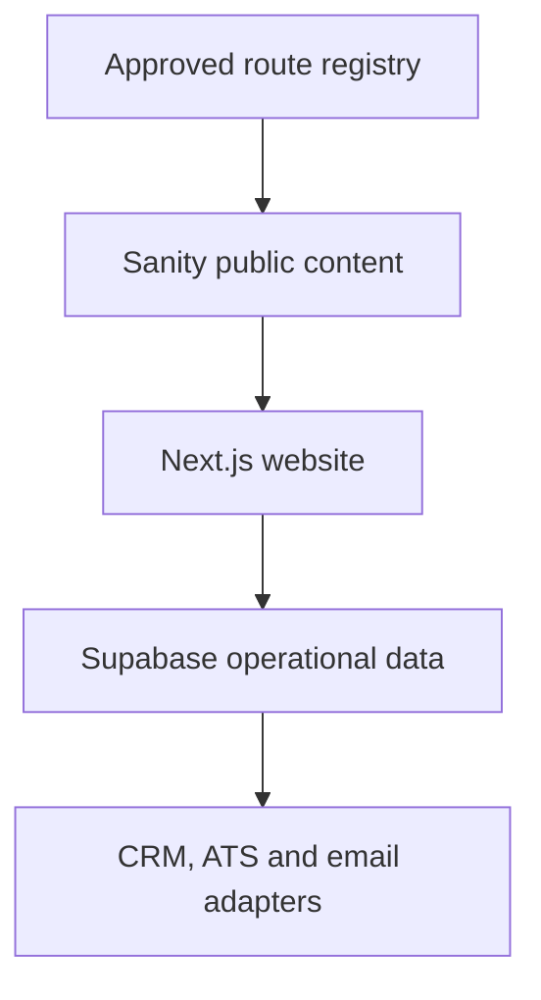
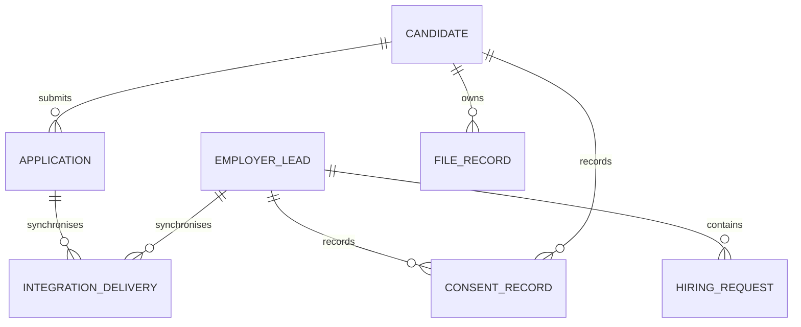
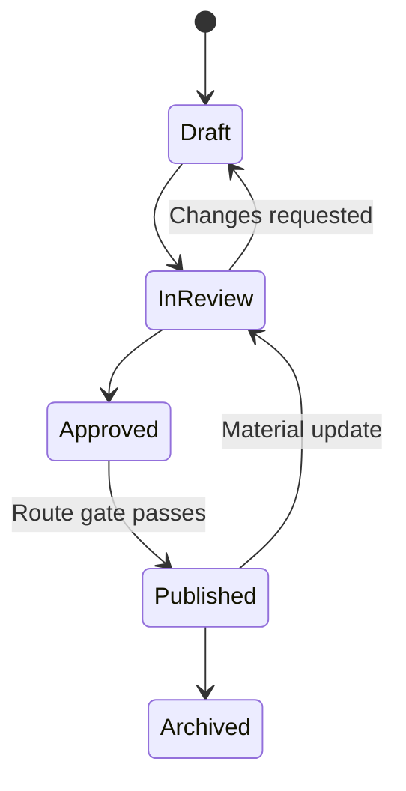

# Apex HR CMS and Data Content Model v1.0

**Status:** Implementation specification  
**Consolidated:** 2 September 2026  
**CMS:** Sanity  
**Operational data:** Supabase PostgreSQL and private Storage  
**Route authority:** `MASTER-SITEMAP.md`, `URL-DECISION-REGISTER.md` and `Apex_HR_Master_Sitemap_and_URL_Register.xlsx`

## 1. Purpose

This document defines how Apex HR content and operational data must be structured before the application scaffold is built. Its purpose is to ensure that:

- the website is CMS-driven rather than a collection of hard-coded pages;
- every public document maps to an approved route and principal intent;
- services, sectors, locations, experts, case studies and insights can be related consistently;
- the 816 possible service-location pages are governed rather than mass-published;
- employer and candidate personal data never enters the public editorial CMS;
- an ATS, CRM, email provider or booking platform can be changed without rewriting page components;
- structured data, navigation, breadcrumbs, canonicals and internal links derive from the same trusted records.

## 2. Core architectural decision

Use two separate data systems with explicit ownership:

| System | Owns | Must not own |
|---|---|---|
| Sanity | Public editorial content, relationships, metadata and approved page configuration | CVs, applications, employer submissions, consent records or private contact data |
| Supabase PostgreSQL | Employer leads, candidate records, applications, consent, attribution and integration state | Public long-form page content or duplicated CMS taxonomies |
| Supabase Storage | Private CVs, job descriptions and application attachments | Public brand imagery or unrestricted personal files |
| ATS, when approved | Live vacancies and recruitment workflow | Marketing pages or general CMS content |
| CRM, when approved | Qualified employer relationship records | Public website content or raw analytics events |
| Analytics | Anonymous or consented interaction events | Names, emails, phone numbers, CV text, free-text form responses or consent evidence |



## 3. Non-negotiable modelling rules

1. Prefer structured fields and references over untyped rich text.
2. Do not let a page title silently determine its production URL.
3. Store the approved canonical path explicitly and validate it against the route registry.
4. Keep editorial workflow status separate from route-governance status.
5. Do not store personal or sensitive submissions in Sanity.
6. Do not create separate documents for repeated display cards when the underlying entity already exists.
7. Use references to drive related-content modules and internal links.
8. Do not paste internal URLs into body text when a structured internal-link reference is possible.
9. Do not duplicate service facts across hundreds of location documents.
10. Do not publish a service-location document merely because its route exists in the planning matrix.
11. Do not create an `office` record without evidence that it is a genuine public Apex HR office.
12. Do not fabricate experts, testimonials, client logos, vacancies, results, salaries, statistics or accreditations.

## 4. Route and editorial state

Every route-bearing document has two separate state controls.

### 4.1 Route status

The `routeStatus` value mirrors the master register:

| Value | CMS treatment |
|---|---|
| `confirmed` | Route may be published when content is approved |
| `corrected` | Corrected route may be published; approved redirects must exist |
| `redirected` | Must not have a publishable content document |
| `provisional` | Cannot be indexed or enter the production sitemap until its gate passes |
| `future` | Must not be implemented or published in the current scope |

### 4.2 Editorial workflow

Use `workflowStatus` for content readiness:

| Value | Meaning |
|---|---|
| `draft` | Incomplete working content |
| `inReview` | Awaiting editorial, subject-matter or legal review |
| `approved` | Approved for publication, subject to route rules |
| `published` | Publicly available |
| `archived` | Retained for history but removed from normal publication |

A route can be Confirmed while its content is Draft. A route can also be Provisional while its content is otherwise complete. Publication requires both route and editorial gates.

### 4.3 Indexing decision

Use `seo.indexing` with these values:

- `indexFollow`
- `noindexFollow`
- `noindexNofollow`

Rules:

- Confirmed or Corrected content may use `indexFollow` after approval.
- Provisional content defaults to `noindexFollow` and remains out of the XML sitemap.
- Future content is not rendered publicly.
- Redirected URLs never render a document.
- Draft and archived content never enters the production sitemap.

## 5. Sanity schema catalogue

### 5.1 Singleton documents

| Schema | Purpose |
|---|---|
| `siteSettings` | Site identity, organisation details, default SEO, social profiles and global configuration |
| `primaryNavigation` | Header navigation, utility links and global CTAs |
| `footer` | Footer columns, legal links, contact display and newsletter presentation |
| `homePage` | Employer-first homepage content and ordered approved modules |
| `notFoundPage` | Helpful 404-page content without route creation |
| `formSettings` | Public form labels, privacy links, consent wording references and confirmation messages; never stores submissions |

Singletons must be created once and removed from the normal “new document” menu.

### 5.2 Route-bearing documents

| Schema | Route family | Initial status |
|---|---|---|
| `standardPage` | Approved top-level and campaign pages | Depends on register |
| `serviceCategory` | Ten canonical parent service pages | Confirmed or Corrected |
| `service` | Forty-eight canonical child service pages | Confirmed or Corrected |
| `sector` | Seventeen sector pages | Confirmed or Corrected |
| `location` | Sixteen location pages | Confirmed or Corrected, with content validation |
| `serviceLocationPage` | Service-location SEO pages | Provisional |
| `talentRole` | Talent-acquisition-by-role pages | Confirmed route; content approval required |
| `insightCategory` | Approved insight topic hubs | Confirmed or Corrected |
| `insight` | Articles and thought leadership | Provisional until created and approved |
| `caseStudy` | Detailed proof and results stories | Provisional until verified |
| `expert` | Practitioner profile pages | Provisional |
| `resource` | Downloadable resources and landing pages | Depends on record |
| `report` | Research and report pages | Provisional |
| `event` | Event and webinar pages | Provisional |
| `job` | Vacancy content only when an ATS does not own it | Provisional |
| `office` | Genuine public office pages and structured location data | Provisional |

### 5.3 Supporting documents

| Schema | Purpose |
|---|---|
| `testimonial` | Verified quotation with source and approval evidence |
| `clientOrganisation` | Approved client or partner identity and logo rights |
| `faqSet` | Reusable, curated FAQ group |
| `author` | Optional separate author identity when an expert is not the author |
| `redirectRecord` | Optional CMS mirror for visibility only; generated application redirect data remains authoritative |

### 5.4 Reusable objects

| Object | Purpose |
|---|---|
| `routeIdentity` | Approved path, route status, principal intent and registry ID |
| `seoFields` | Search, canonical, social and indexing configuration |
| `editorialWorkflow` | Workflow state, owner and review dates |
| `accessibleImage` | Image, alt text, caption, credit and decorative flag |
| `internalLink` | Reference-based internal destination |
| `externalLink` | Validated external destination |
| `cta` | Label, destination, style and analytics identifier |
| `portableText` | Constrained rich content with approved blocks and links |
| `statistic` | Verified metric, context, source and validity date |
| `faqItem` | Question and concise answer |
| `personName` | Structured name fields where needed |
| `address` | Postal address used only for verified offices or contact information |
| `attributionContext` | Non-personal source identifiers used to configure CTAs and forms |

## 6. Shared field groups

### 6.1 `routeIdentity`

| Field | Type | Required | Rule |
|---|---|---:|---|
| `registryId` | string | Yes | Must match a route ID from the master register where one exists |
| `canonicalPath` | string | Yes | Exact lowercase path; `/` or trailing slash required |
| `routeStatus` | enum | Yes | One of the five governed route states |
| `principalIntent` | string | Yes for indexable pages | One concise user/search intent |
| `primaryKeyword` | string | Recommended | One direction, not a comma-separated keyword dump |
| `redirectFrom` | array of strings | No | Display/reference only; application redirect registry remains authoritative |
| `routeNotes` | text | No | Editorial context, not public copy |

Validation:

- `canonicalPath` must begin with `/`.
- It must be lowercase and contain no spaces, underscores, query strings or fragments.
- It must end with `/`, except `/` itself.
- It must be unique across all route-bearing documents.
- It must match the route registry entry for `registryId`.
- Editors must not be able to create a Redirected route as a public document.

### 6.2 `seoFields`

| Field | Type | Required | Rule |
|---|---|---:|---|
| `seoTitle` | string | Yes for indexable pages | Unique, descriptive and aligned with principal intent |
| `metaDescription` | text | Yes for indexable pages | Concise and page-specific |
| `canonicalOverride` | URL | No | Use only for a documented exception |
| `indexing` | enum | Yes | Defaults according to route status |
| `openGraphTitle` | string | No | Falls back to SEO/public title |
| `openGraphDescription` | text | No | Falls back to meta description |
| `openGraphImage` | `accessibleImage` | No | Must not contain misleading evidence |
| `schemaTypes` | read-only array | Generated | Derived from document type rather than chosen freely |

Do not expose arbitrary schema markup text fields to editors. Generate JSON-LD from validated document fields.

### 6.3 `editorialWorkflow`

| Field | Type | Required |
|---|---|---:|
| `workflowStatus` | enum | Yes |
| `contentOwner` | string or internal user reference | Yes |
| `subjectMatterReviewer` | reference to `expert` or internal reviewer | Recommended |
| `legalReviewRequired` | boolean | Yes |
| `lastReviewedAt` | datetime | Required before publication |
| `nextReviewAt` | datetime | Required for legal, employment or fast-changing guidance |
| `approvalNotes` | text | No |

### 6.4 `accessibleImage`

| Field | Type | Required | Rule |
|---|---|---:|---|
| `asset` | image | Yes | Hotspot enabled when useful |
| `alt` | string | Conditional | Required unless explicitly decorative |
| `decorative` | boolean | Yes | When true, public alt output is empty |
| `caption` | string | No | Visible explanatory caption |
| `credit` | string | No | Rights/source information |
| `focalPointNote` | string | No | Editor guidance for safe crops |

## 7. Controlled page composition

Do not implement an unrestricted page builder. Use fixed templates for the homepage, services, sectors, locations, talent roles, jobs, insights, case studies and experts. Allow flexible sections only for `standardPage` and approved campaign pages.

Approved reusable section objects:

| Section | Key fields | Validation |
|---|---|---|
| `heroSection` | eyebrow, heading, summary, media, primary CTA, secondary CTA | One H1 source per page; CTA destination required |
| `trustStripSection` | approved logos, accreditations or verified statistics | Every claim requires evidence or a source note |
| `needSelectorSection` | heading and two to four need cards | Each card requires a structured internal destination |
| `problemSolutionSection` | employer challenge, implication, linked solution | Avoid generic duplicate copy |
| `serviceGridSection` | selected service references, display mode | References only; do not duplicate service descriptions |
| `recruitmentSpotlightSection` | approved recruitment services and CTA | Must reference canonical services |
| `valuePropositionSection` | verified differentiators and proof | No unverified superlatives |
| `sectorGridSection` | selected sector references | IT and Professional Services remain distinct |
| `processSection` | three to six ordered process steps | Each step needs a short label and explanation |
| `caseStudySection` | selected case-study references | Only approved case studies may appear |
| `expertSection` | selected expert references | Only real approved practitioners |
| `candidateGatewaySection` | Jobs, CV and Talent Pool CTAs | Visually secondary on the homepage |
| `insightFeedSection` | category/filter, manual selection and limit | Never expose drafts |
| `testimonialSection` | selected testimonial references | Requires permission and verification |
| `logoMarqueeSection` | approved client/partner references | Provide reduced-motion behaviour |
| `faqSection` | inline items or referenced FAQ set | Questions must be relevant to visible page content |
| `richTextSection` | constrained Portable Text | No arbitrary scripts or raw HTML |
| `finalCtaSection` | heading, summary and one or two CTAs | CTA analytics ID required |

## 8. Singleton specifications

### 8.1 `siteSettings`

Required fields:

- `siteName`
- `legalOrganisationName`
- `productionUrl`
- `defaultLocale` — initially `en-GB`
- `defaultSeo`
- `organisationDescription`
- `logoPrimary`
- `logoReversed`
- `favicon`
- `socialProfiles`
- `defaultContactEmail` only when approved for public display
- `defaultPhone` only when approved for public display
- `privacyPolicyReference`
- `cookiePolicyReference`
- `termsReference`
- `organisationSchema` fields supported by visible evidence

Never add aggregate ratings, addresses, founding dates or market claims solely to enrich schema.

### 8.2 `primaryNavigation`

Fields:

- `primaryItems`
- `utilityItems`
- `candidateItems`
- `primaryCta` — Find Talent
- `mobileMenuLabel`
- `accessibilityLabel`

Every internal item references a document or governed route. Do not store independent URL copies for the same destination.

### 8.3 `footer`

Fields:

- `columns`
- `legalLinks`
- `contactDisplay`
- `socialLinks`
- `newsletterBlock`
- `copyrightTemplate`
- `certificationOrMembershipReferences`

### 8.4 `homePage`

The homepage uses structured fields in this order:

1. `hero`
2. `trustAndCredibility`
3. `employerNeedSelector`
4. `employerProblems`
5. `serviceOverview`
6. `recruitmentSpotlight`
7. `whyApex`
8. `sectorOverview`
9. `deliveryProcess`
10. `featuredCaseStudies`
11. `featuredExperts`
12. `candidateGateway`
13. `latestInsights`
14. `employerFaqs`
15. `finalEmployerCta`

Do not permit editors to move the candidate gateway above the core employer proposition without an approved strategy change.

## 9. Service schemas

### 9.1 `serviceCategory`

Required fields:

- `internalTitle`
- `publicTitle`
- `route`
- `summary`
- `introduction`
- `children` — references to canonical `service` documents
- `featuredServices`
- `relatedSectors`
- `featuredCaseStudies`
- `featuredExperts`
- `featuredInsights`
- `faqs`
- `finalCta`
- `seo`
- `workflow`

Validation:

- There must be exactly ten seeded canonical category documents.
- `children` cannot reference the same service twice.
- Every child service's `category` must point back to the same category.
- The category route must match the master register.

### 9.2 `service`

Required template fields:

- `internalTitle`
- `publicTitle`
- `route`
- `category`
- `heroSummary`
- `employerChallenge`
- `businessOutcomes`
- `serviceComponents`
- `whenNeeded`
- `whoWeSupport`
- `deliveryApproach`
- `engagementOptions`
- `whyApex`
- `proof`
- `featuredExpert`
- `relatedServices` — maximum four
- `relatedInsights` — normally two to four
- `faqs`
- `serviceCta`
- `seo`
- `workflow`

Optional fields:

- `relatedSectors`
- `relatedLocations`
- `featuredCaseStudy`
- `downloadableResources`
- `serviceSchemaAdditionalType` when justified

Validation:

- Seed exactly 48 canonical child service documents.
- `relatedServices` cannot include the current document.
- The route must be a Confirmed or Corrected canonical flat service route.
- One service must have one principal intent.
- A service cannot publish with an empty challenge, outcomes, approach or CTA.
- Evidence is required before publishing numerical results or client claims.

## 10. Sector and location schemas

### 10.1 `sector`

Fields:

- `internalTitle`
- `publicTitle`
- `route`
- `overview`
- `sectorChallenges`
- `howApexHelps`
- `recommendedServices`
- `relevantTalentRoles`
- `featuredCaseStudies`
- `featuredExperts`
- `featuredInsights`
- `faqs`
- `finalCta`
- `seo`
- `workflow`

Seed the 17 approved records. Professional Services uses `/sector/hr-company-for-professional-services-in-the-uk/`; IT uses `/sector/hr-company-for-it-in-the-uk/` (see `docs/URL-DECISION-REGISTER.md` D-017 for the current sector URL convention).

### 10.2 `location`

Fields:

- `internalTitle`
- `publicTitle`
- `route`
- `regionOrNation`
- `overview`
- `verifiedCoverageStatement`
- `recommendedServices`
- `relevantInsights`
- `faqs`
- `office` — optional reference to a verified office
- `seo`
- `workflow`

Rules:

- Seed the 16 corrected location records.
- Nottingham, Worcester and Staffordshire use the corrected spellings.
- A location document does not prove a physical office.
- Do not add address or `LocalBusiness` data unless `office` references a verified public office.

### 10.3 `serviceLocationPage`

Fields:

- `service`
- `locationScope` — reference to a `location` or the controlled `uk` value
- `route`
- `localIntent`
- `localIntroduction`
- `localChallenges`
- `verifiedAvailabilityStatement`
- `localProof`
- `localFaqs`
- `relatedInsights`
- `finalCta`
- `contentGate`
- `seo`
- `workflow`

`contentGate` contains:

- `serviceAvailabilityVerified`
- `originalContentVerified`
- `uniqueMetadataVerified`
- `localValueVerified`
- `proofClaimsVerified`
- `intentOverlapReviewed`
- `editorApproved`
- `seoApproved`
- `approvedAt`
- `approvedBy`

Validation:

- The service and location pair must be unique.
- The path must match the exact flat route in the register.
- All 816 seeded records begin as Provisional and `noindexFollow`.
- `indexFollow` is forbidden until every content-gate boolean is true.
- A UK record and a city record cannot reuse identical body copy.
- Location-only token replacement does not satisfy original-content validation.

## 11. Talent role schema

### `talentRole`

Fields:

- `roleName`
- `route`
- `roleFamily`
- `overview`
- `employerHiringChallenges`
- `candidateMarketContext`
- `recruitmentApproach`
- `relatedServices`
- `relatedSectors`
- `featuredExpert`
- `featuredCaseStudy`
- `relatedInsights`
- `faqs`
- `findTalentCta`
- `seo`
- `workflow`

Seed the 62 approved TAR records. Use one template; do not create 62 separate components.

## 12. Expertise, proof and authority

### 12.1 `expert`

Fields:

- `fullName`
- `route`
- `jobTitle`
- `professionalSummary`
- `biography`
- `portrait`
- `areasOfExpertise`
- `services`
- `sectors`
- `qualifications`
- `professionalMemberships`
- `authoredInsights`
- `reviewedInsights`
- `caseStudies`
- `publicContactLinks` only when approved
- `seo`
- `workflow`

Validation:

- Profiles must represent real approved practitioners.
- Qualifications and memberships require verification.
- Do not expose private email addresses or phone numbers by default.
- `Person` and `ProfilePage` schema must derive only from visible verified fields.

### 12.2 `caseStudy`

Fields:

- `internalTitle`
- `publicTitle`
- `route`
- `client` — optional approved reference
- `anonymisedClientDescription` when identity cannot be public
- `services`
- `sectors`
- `locations`
- `challenge`
- `context`
- `approach`
- `solution`
- `impact`
- `verifiedResults`
- `testimonial`
- `leadExpert`
- `supportingExperts`
- `finalCta`
- `proofApproval`
- `seo`
- `workflow`

`proofApproval` records the internal evidence owner, approval date and which claims may be public. Do not publish results that cannot be substantiated.

### 12.3 `testimonial`

Fields:

- `quotation`
- `attributionName`
- `attributionRole`
- `organisation`
- `anonymisedAttribution`
- `permissionConfirmed`
- `permissionRecordedAt`
- `relatedServices`
- `relatedCaseStudy`
- `status`

Publishing is blocked unless permission is confirmed or the approved anonymisation standard is used.

### 12.4 `clientOrganisation`

Fields:

- `name`
- `logo`
- `website`
- `relationshipType`
- `displayPermissionConfirmed`
- `permissionRecordedAt`
- `approvedContexts`

Do not use this document as a CRM customer record.

## 13. Insights and resources

### 13.1 `insightCategory`

Fields:

- `title`
- `route`
- `summary`
- `featuredInsights`
- `relatedServices`
- `seo`
- `workflow`

Seed the eight approved category records.

### 13.2 `insight`

> **Architectural update (docs/URL-DECISION-REGISTER.md D-016):** the source of truth for `insight` records is now WordPress (`blog.apexhrllc.co.uk`), consumed headlessly by `src/lib/wordpress/`, not this document's original Sanity schema — this is a later, explicit decision recorded here rather than a silent overwrite. Individual articles are served at the root-level `/[article-slug]/`, not nested under `/insights/`. `insightCategory` (13.1) is unaffected and remains a local, Sanity-modelled concept. This does not change the CMS boundary for any other content type in this document — Sanity remains the intended editorial CMS for services, sectors, locations, talent roles, experts, case studies, resources, reports and events unless a separate decision says otherwise, and Supabase remains unaffected for all operational data.

Fields (as originally modelled for Sanity; WordPress's own REST schema — `title.rendered`, `excerpt.rendered`, `content.rendered`, `_embedded` author/featured-media/terms, `yoast_head_json` — is normalised into an equivalent internal shape by `src/lib/wordpress/types.ts`'s `Article` type, not mapped field-for-field onto the list below):

- `internalTitle`
- `publicTitle`
- `route`
- `format` — article, guide, commentary or research summary
- `summary`
- `featuredImage`
- `body`
- `categories`
- `primaryCategory`
- `author`
- `expertReviewer`
- `publishedAt`
- `updatedAt`
- `nextReviewAt`
- `relatedServices`
- `relatedSectors`
- `relatedTalentRoles`
- `relatedCaseStudies`
- `sourcesAndEvidence`
- `finalCta`
- `seo`
- `workflow`

Rules:

- A topic-cluster title does not become a route until content is created and approved.
- Employment-law or fast-changing guidance requires a reviewer and review date.
- Dates displayed publicly must reflect the actual publication and material update history.
- `Article` or `BlogPosting` schema derives from the approved visible author and dates.

### 13.3 `resource`

Fields:

- `title`
- `route`
- `resourceType`
- `summary`
- `coverImage`
- `body`
- `downloadAsset` or approved external destination
- `gated`
- `relatedServices`
- `relatedInsights`
- `seo`
- `workflow`

Do not place personal download records or form submissions in this document.

### 13.4 `report`

Extends the resource pattern with:

- `reportingPeriod`
- `methodology`
- `contributors`
- `publicationDate`
- `keyFindings`
- `downloadAsset`

### 13.5 `event`

Fields:

- `title`
- `route`
- `eventType` — event or webinar
- `summary`
- `startAt`
- `endAt`
- `timezone`
- `venueType`
- `verifiedVenue`
- `registrationDestination`
- `speakers`
- `relatedServices`
- `recordingResource`
- `seo`
- `workflow`

Expired events must show a clear status and must not continue presenting an active registration CTA.

## 14. Jobs and recruitment content

### 14.1 Source-of-truth strategy

Prefer the approved ATS as the source of truth for vacancies. Map ATS records into an internal read model used by the website. Do not let Sanity and the ATS independently own the same live job.

Use the Sanity `job` document only when no ATS is available or for controlled editorial enrichment linked by `externalJobId`.

### 14.2 `job`

Fields:

- `externalJobId`
- `route`
- `title`
- `referenceCode`
- `summary`
- `description`
- `responsibilities`
- `requirements`
- `locationDisplay`
- `sector`
- `function`
- `seniority`
- `employmentType`
- `workArrangement`
- `salaryDisplay` only when supplied and approved
- `publishedAt`
- `closesAt`
- `status` — draft, open, paused, closed or expired
- `applicationDestination`
- `seo`

Rules:

- Only open, approved jobs may use `indexFollow` and `JobPosting` schema.
- Expired or closed jobs must lose active `JobPosting` markup.
- Never invent salary, location or closing date.
- Job filters must not create unlimited indexable URL combinations.

## 15. FAQs and links

### 15.1 `faqSet`

Fields:

- `internalTitle`
- `items`
- `relatedServices`
- `relatedSectors`
- `reviewOwner`
- `lastReviewedAt`

`FAQPage` structured data may be emitted only when the questions and answers are visibly rendered and current. Do not create FAQ markup merely for search engines.

### 15.2 Internal links

`internalLink` fields:

- `destination` — reference to a route-bearing document
- `label`
- `anchorIntent`
- `openInNewTab` — normally false
- `analyticsId` when used as a CTA

Resolve the URL from the destination's governed route. If the destination is unpublished or non-indexable, validation must warn or block publication according to context.

### 15.3 CTA

Fields:

- `label`
- `destinationType` — internal, external, Find Talent, Search Jobs, Talent Pool, CV Upload or booking
- `internalDestination`
- `externalDestination`
- `style`
- `analyticsId`
- `contextService`
- `contextSector`

`analyticsId` must be stable, lowercase and non-personal.

## 16. Supabase operational model

Sanity contains no submissions. The operational database uses UUID primary keys, UTC timestamps, explicit status fields, least-privilege access and Row Level Security.



### 16.1 `employer_leads`

Purpose: employer identity, contact details, qualification and submission state.

Core columns:

- `id`
- `company_name`
- `contact_name`
- `work_email`
- `phone`
- `company_size`
- `additional_context`
- `status`
- `originating_path`
- `cta_id`
- `service_context_id`
- `sector_context_id`
- `utm_source`
- `utm_medium`
- `utm_campaign`
- `utm_term`
- `utm_content`
- `referrer`
- `landing_path`
- `crm_record_id`
- `created_at`
- `updated_at`

Do not copy this record into analytics.

### 16.2 `hiring_requests`

Purpose: structured need submitted through Find Talent.

Core columns:

- `id`
- `employer_lead_id`
- `role_title`
- `location_text`
- `employment_type`
- `vacancy_count`
- `seniority`
- `salary_min`
- `salary_max`
- `salary_currency`
- `required_skills`
- `hiring_timeline`
- `job_description_file_id`
- `status`
- `created_at`

Use controlled values where practical while allowing a safe “not listed” path.

### 16.3 `candidates`

Purpose: candidate identity and recruitment profile.

Core columns:

- `id`
- `first_name`
- `last_name`
- `email`
- `phone`
- `current_location`
- `professional_summary`
- `availability`
- `talent_pool_status`
- `ats_candidate_id`
- `created_at`
- `updated_at`
- `retention_review_at`

### 16.4 `candidate_preferences`

Core columns:

- `id`
- `candidate_id`
- `preferred_locations`
- `employment_types`
- `work_arrangements`
- `functions`
- `sectors`
- `seniority_levels`
- `salary_expectation`
- `currency`

CMS identifiers may be stored for relationship context, but personal data must not be copied back to Sanity.

### 16.5 `applications`

Core columns:

- `id`
- `candidate_id`
- `job_external_id`
- `job_path`
- `cv_file_id`
- `cover_letter_file_id`
- `application_answers`
- `status`
- `ats_application_id`
- `originating_path`
- `cta_id`
- `submitted_at`
- `updated_at`

Sensitive answers should be minimised, documented and excluded from logs and analytics.

### 16.6 `talent_pool_registrations`

Core columns:

- `id`
- `candidate_id`
- `status`
- `source_path`
- `cta_id`
- `joined_at`
- `withdrawn_at`

Do not treat newsletter consent as talent-pool consent or vice versa.

### 16.7 `file_records`

Purpose: metadata for private objects stored outside public web access.

Core columns:

- `id`
- `owner_type`
- `owner_id`
- `purpose`
- `bucket`
- `object_path`
- `original_filename`
- `detected_mime_type`
- `size_bytes`
- `checksum`
- `malware_scan_status`
- `created_at`
- `retention_expires_at`
- `deleted_at`

Never store public signed URLs. Generate short-lived signed access only after authorisation.

### 16.8 `consent_records`

Core columns:

- `id`
- `subject_type`
- `subject_id`
- `purpose`
- `policy_version`
- `consent_text_version`
- `granted`
- `recorded_at`
- `withdrawn_at`
- `source_path`

Consent records are evidence and must not be inferred solely from analytics or form-submission existence.

### 16.9 `newsletter_subscriptions`

Core columns:

- `id`
- `email`
- `status`
- `consent_record_id`
- `email_provider_contact_id`
- `source_path`
- `subscribed_at`
- `unsubscribed_at`

This may become a lightweight synchronization record when the approved email provider owns subscription state.

### 16.10 `integration_deliveries`

Purpose: transactional outbox and secure delivery state for CRM, ATS, email and other adapters.

Core columns:

- `id`
- `aggregate_type`
- `aggregate_id`
- `integration_type`
- `operation`
- `idempotency_key`
- `status`
- `attempt_count`
- `next_attempt_at`
- `last_error_code`
- `external_record_id`
- `created_at`
- `completed_at`

Do not store access tokens or full sensitive payloads in this table.

### 16.11 `webhook_events`

Core columns:

- `id`
- `provider`
- `external_event_id`
- `event_type`
- `signature_verified`
- `processing_status`
- `received_at`
- `processed_at`

Enforce uniqueness on provider plus external event ID to make webhook processing idempotent.

## 17. Private file storage

Recommended private buckets:

| Bucket | Contents |
|---|---|
| `candidate-cvs` | Candidate CV files |
| `application-files` | Cover letters and approved application attachments |
| `employer-job-descriptions` | Employer-uploaded job descriptions |

Controls:

- All buckets are private.
- Uploads use generated object paths, not raw filenames.
- Validate extension, MIME type, file signature and size server-side.
- Run an approved malware-scanning process before internal access.
- Store only the minimum necessary metadata.
- Use documented retention and deletion schedules.
- Never expose storage service credentials to the browser.

## 18. Integration contracts

Use provider-neutral interfaces:

- `ContentRepository`
- `RouteRegistry`
- `CrmClient`
- `AtsClient`
- `EmailClient`
- `CalendarClient`
- `FileStorageClient`

The application maps external provider data into internal typed records. Vendor SDKs stay inside integration modules.

Recommended operations:

- `CrmClient.createOrUpdateEmployerLead()`
- `CrmClient.attachHiringRequest()`
- `AtsClient.listJobs()`
- `AtsClient.getJob()`
- `AtsClient.createOrUpdateCandidate()`
- `AtsClient.submitApplication()`
- `EmailClient.sendEmployerConfirmation()`
- `EmailClient.sendCandidateConfirmation()`
- `EmailClient.sendInternalNotification()`
- `CalendarClient.getBookingDestination()`

Persist the website submission before attempting non-transactional external delivery. Use idempotency keys, safe retries and an outbox worker.

## 19. Sanity Studio structure

Recommended editorial navigation:

1. Site configuration
   - Site Settings
   - Primary Navigation
   - Footer
   - Forms
2. Homepage
3. Services
   - Service Categories
   - Services by Category
   - Provisional Additional Services
4. Sectors
5. Locations
6. Service-location pages
   - Awaiting Content
   - In Review
   - Approved
7. Talent Acquisition Roles
8. Proof and Expertise
   - Case Studies
   - Experts
   - Testimonials
   - Client Organisations
9. Insights
   - Categories
   - Drafts
   - In Review
   - Published
   - Review Due
10. Resources
    - Reports
    - Events and Webinars
11. Jobs, only when Sanity is the active source
12. Standard Pages
13. Archived Content

Hide technical singleton documents and route registry fields from casual editing where practical.

## 20. Roles and permissions

Recommended roles:

| Role | Permission scope |
|---|---|
| Administrator | Schema, configuration, publishing and access management |
| Managing Editor | Create, review and publish approved editorial content |
| Service Owner | Edit assigned service, sector and related content; submit for review |
| Expert Contributor | Draft or review assigned insights and profile content |
| SEO Editor | Edit metadata, relationships and indexation within route constraints |
| Legal/Compliance Reviewer | Review regulated, employment-law and privacy-sensitive content |

Route paths, route status, organisation identity and verified proof fields should have narrower permissions than ordinary page copy.

## 21. Content lifecycle



Publication checks:

- route is Confirmed or Corrected, or a Provisional route has documented approval;
- workflow is Approved;
- required template fields are complete;
- SEO title, description and canonical path are valid;
- referenced content is publishable;
- claims and statistics are supported;
- privacy and consent copy references the approved current policy;
- images contain appropriate alt text or are marked decorative;
- review date is present where required.

## 22. Preview, publishing and cache revalidation

- Use Sanity preview/draft mode for authenticated editorial preview.
- Preview must never make a draft publicly indexable.
- On publish, validate the route against the generated registry.
- Use signed Sanity webhooks to revalidate affected pages.
- Revalidate directly referenced pages when an entity changes; for example, a service update may affect its category, related sectors, experts and homepage modules.
- Do not purge the whole application cache for a small content update unless necessary.
- Store no personal submission data in page caches.

## 23. Frontend content contracts

Use explicit query projections and TypeScript types rather than passing raw CMS documents into components.

Recommended view models:

- `HomePageViewModel`
- `ServiceCategoryViewModel`
- `ServicePageViewModel`
- `SectorPageViewModel`
- `LocationPageViewModel`
- `ServiceLocationPageViewModel`
- `TalentRolePageViewModel`
- `InsightPageViewModel`
- `CaseStudyPageViewModel`
- `ExpertPageViewModel`
- `JobPageViewModel`

Each view model should contain:

- resolved canonical path;
- public title and summary;
- only the fields used by its template;
- resolved internal link labels and destinations;
- image metadata needed for responsive rendering;
- SEO fields;
- structured-data inputs;
- route and workflow state needed to decide render, redirect or `notFound()`.

Do not expose Sanity `_rev`, private notes, approval evidence or internal workflow data to the browser unless required for authenticated preview.

## 24. Generated route registry

Convert the approved workbook into a version-controlled machine-readable registry during implementation, for example:

```text
src/config/routes.generated.ts
src/config/redirects.generated.ts
```

The generation process must:

- preserve exact canonical paths and route IDs;
- include status, family, indexability and redirect target;
- reject duplicate canonical URLs;
- reject unknown status values;
- reject uppercase, missing trailing slash and invalid path formats;
- prevent Redirected and Future routes from becoming normal pages;
- produce deterministic output;
- fail CI when generated output is stale.

Editors may manage content for registered routes, but they must not use Sanity to silently override the governed route registry.

## 25. Initial seeding plan

Seed in this order:

1. Site settings and required singletons.
2. Ten service categories.
3. Forty-eight canonical child services.
4. Seventeen sectors.
5. Sixteen locations.
6. Eight insight categories.
7. Sixty-two talent-role records.
8. Provisional service-location records only if the team needs an editorial queue; otherwise create them on demand from the registry.
9. Approved experts, case studies, testimonials and client organisations after evidence review.
10. Standard pages and approved resources.

Seed records with route identity and internal title only where public copy is not yet approved. Do not publish placeholder text.

## 26. Validation and automated checks

At minimum, CI and CMS validation must check:

- canonical path matches the route registry;
- no duplicate canonical path exists;
- every service references one valid category;
- every category-child relationship is consistent in both directions;
- every service-location pair is unique;
- Provisional and Future routes are excluded from the production sitemap;
- redirects have a valid canonical destination and no loops;
- internal references do not point to drafts in production;
- indexable pages have required SEO fields;
- images have alt text or a decorative declaration;
- related-service lists contain no self-reference or duplicates;
- case-study claims have approval evidence;
- expired jobs have no active application CTA or `JobPosting` markup;
- no personal-data field is defined in a Sanity schema;
- private file buckets reject public access;
- analytics payload tests reject personal-data properties.

## 27. Implementation sequence

### Phase A — Schema foundation

- Install/configure Sanity within the project structure.
- Create shared objects and singleton schemas.
- Create the generated route registry.
- Add document-level route validation.
- Build the editorial Studio structure.

### Phase B — Employer content

- Seed service categories and services.
- Seed sectors and corrected locations.
- Implement homepage and service templates.
- Implement experts, case studies, testimonials and FAQs.

### Phase C — Content engine

- Seed insight categories and talent roles.
- Implement insights, resources, reports and events.
- Add review dates, authorship and authority relationships.

### Phase D — Operational workflows

- Create Supabase migrations and private buckets.
- Implement Find Talent persistence, consent and attribution.
- Add candidate, application and talent-pool records.
- Connect provider-neutral adapters when vendors are approved.

### Phase E — Governed SEO expansion

- Create service-location records only through the content gate.
- Validate originality and verified coverage.
- Add approved pages to the sitemap incrementally.

## 28. Decisions still required before production

The content architecture is defined, but these operational decisions remain open:

- Sanity project, dataset names and production/editorial environments.
- Named editorial users and publishing permissions.
- CRM vendor and field mapping.
- ATS vendor and vacancy/application ownership.
- Email marketing and transactional email providers.
- Booking platform.
- File-size limits and final upload allowlist.
- Candidate, application, lead and file-retention periods.
- Final privacy, cookie and consent wording.
- Evidence owner for testimonials, case studies, statistics and client logos.
- Whether all 816 service-location records should be pre-seeded or created only after demand approval.

These decisions must be entered in the project decision register when approved. They do not block creation of provider-neutral schemas and interfaces.

## 29. Definition of done

The CMS and data-model foundation is complete when:

- all schemas compile and Studio loads without warnings;
- singletons cannot be duplicated;
- canonical route records are seeded correctly;
- all route validation tests pass;
- Sanity contains no personal-submission fields;
- Supabase migrations apply cleanly to an empty database;
- Row Level Security and private storage policies are tested;
- preview works without exposing drafts publicly;
- publish webhooks revalidate the correct pages;
- service, sector, location, expert, case-study and insight relationships render correctly;
- Provisional service-location pages remain out of the production sitemap;
- required accessibility, SEO and structured-data fields are enforced;
- documentation and environment-variable examples match the implementation.
